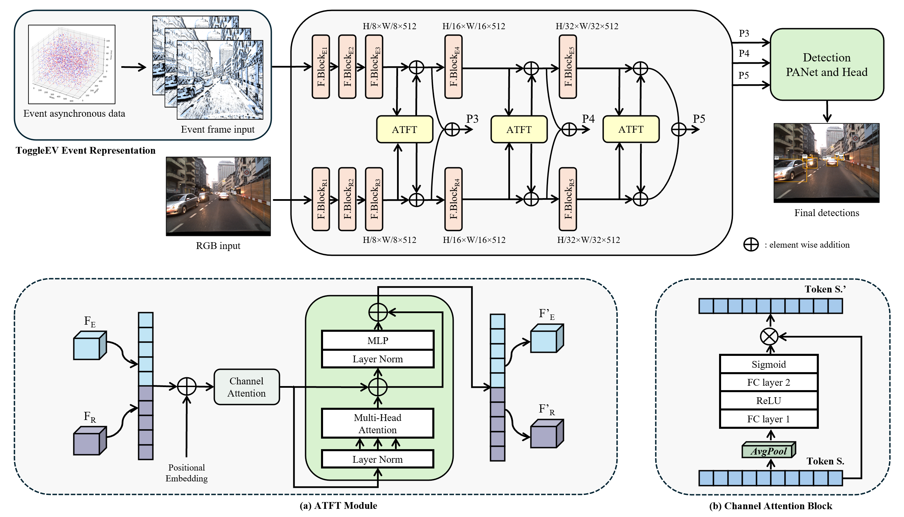

<h1 align="center">
Adaptive Token Fusion Transformer for Multi-Modal Object Detection with RGB and Event Data
</h1>

Official code implementation for the paper "Adaptive Token Fusion Transformer for Multi-Modal Object Detection with RGB and Event Data", accepted at Automation 2025 in Kaohsiung, Taiwan.

If you find this work useful for your research, please cite our paper:
```
@InProceedings{la2025adaptive,
  title     = {Adaptive Token Fusion Transformer for Multi-Modal Object Detection with RGB and Event Data},
  author    = {La, Vi-Minh and Jhong, Sin-Ye and Lin, Hsin-Chun and Chen, Yung-Yao and Yang, Chao-Lung},
  booktitle = {The 22nd International Conference on Automation Technology (Automation 2025)},
  year      = {2025},
}
```



## Abstract

Object detection under challenging conditions, such as low illumination and high dynamic range, remains a limitation for conventional frame-based cameras. Event cameras, which asynchronously record pixel-level brightness changes with high temporal resolution and wide dynamic range, offer a complementary sensing modality. In this work, we introduce a novel framework that encourages joint learning of RGB and event data within a shared feature space using the Transformer. At the preprocessing step, ToggleEV event representation combines positive and negative event counts with a polarity transition map, enabling precise encoding of spatial event distributions and motion patterns in a compact structured format. The Adaptive Token Fusion Transformer (ATFT) modules operate across multiple feature scales, leveraging attention mechanisms to integrate informative tokens and suppress cross-modal noise. Extensive experiments on the public DSEC-Detection dataset demonstrate that our fusion method outperforms the state-of-the-art approach.

## Package Installation

To install the required packages, run:

```
pip3 install -r requirements.txt
pip3 install torch torchvision torchaudio --index-url https://download.pytorch.org/whl/cu126
```

## Dataset

DSEC-Detection dataset extends the original DSEC collection by providing high-quality bounding box annotations on sequences recorded using a multi-sensor driving platform equipped with Prophesee Gen3.1 event cameras and synchronized FLIR Blackfly S color cameras. It comprises 60 sequences in total, divided into 47 training sequences (63,239 frames) and 13 test sequences (15,105 frames).

DSEC-Detection is available here: [https://dsec.ifi.uzh.ch](https://dsec.ifi.uzh.ch)

Organize them into the following directory structure:

```
└── DSEC-Det
    ├── label
    |   ├── train
    |   |   ├── interlaken__00_c
    |   |   |   ├── timestamps.txt
    |   |   |   └── tracks.npy
    |   |   └── ...
    |   └── val
    |       ├── interlaken__00_a
    |       |   ├── timestamps.txt
    |       |   └── tracks.npy
    |       └── ...
    ├── train
    |   ├── interlaken__00_c
    |   |   ├── events
    |   |   |   └── events.h5
    |   |   └── rgb
    |   |       ├── 000000.png
    |   |       └── ...
    |   └── ...
    └── val
        ├── interlaken__00_a
        |   ├── events
        |   |   └── events.h5
        |   └── rgb
        |       ├── 000000.png
        |       └── ...
        └── ...
```

Implement ToggleEV event representation to preprocess raw event data:
```
python3 toggleEV.py
```

Generate labels and clean image files for downstream processes:
```
python3 toolbox.py
```

## Training

To train ATFT model, run:
```
python3 train_fusion.py
```

## Validation

To validate ATFT model using our pretrained weights, run:
```
python3 val_fusion.py
```

## Code Acknowledgments
This project has used code from the following project:
- [Ultralytics YOLO11](https://github.com/ultralytics/ultralytics)
